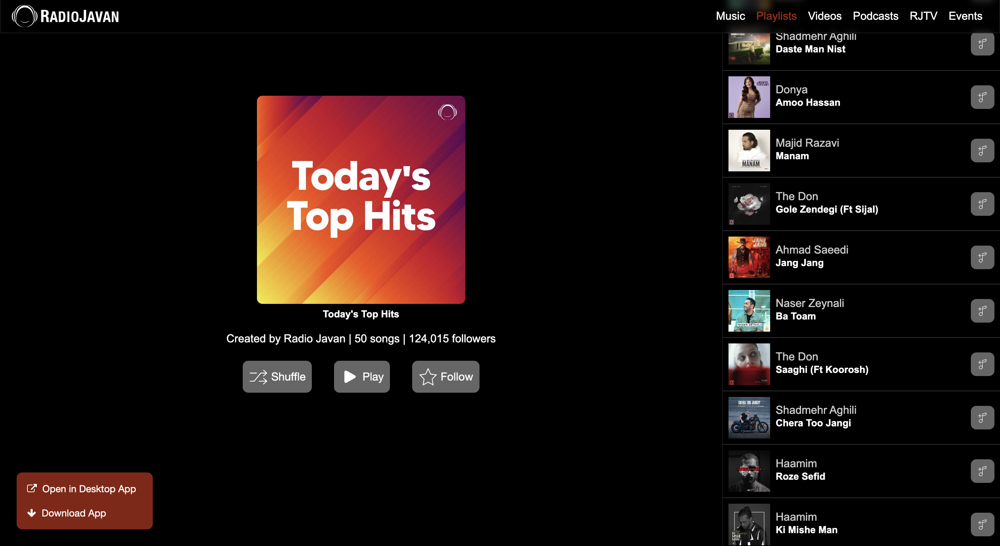

## Puppeteer Web Scraping and speed of headless 

Puppeteer is a Node.js library that provides a high-level API for controlling headless Chrome or Chromium over the DevTools Protocol. It is a powerful tool for web scraping because it allows you to scrape websites that use JavaScript, cookies, and other complex features that may not be possible to scrape with a traditional web scraper.

To use Puppeteer for web scraping, you will need to install it using npm (the Node Package Manager). Once installed, you can use Puppeteer in your Node.js script to programmatically control a headless Chrome browser and perform web scraping tasks.

Here is a simple example of how to use Puppeteer to scrape a webpage:

``` js
const puppeteer = require('puppeteer');

(async () => {
  const browser = await puppeteer.launch();
  const page = await browser.newPage();
  await page.goto('https://example.com');

  // Extract data from the page
  const data = await page.evaluate(() => {
    const name = document.querySelector('h1').textContent;
    const price = document.querySelector('.price').textContent;
    return { name, price };
  });

  console.log(data);

  await browser.close();
})();
```
In this example, Puppeteer is used to open a new page in a headless Chrome browser, navigate to the specified URL, and then extract data from the page by using DOM manipulation methods like querySelector. The extracted data is stored in an object and logged to the console.



Puppeteer also provides many other useful features for web scraping, such as the ability to handle cookies, manipulate the DOM, and simulate user events like clicks and form submissions. With these capabilities, Puppeteer can be used to scrape virtually any modern website.

